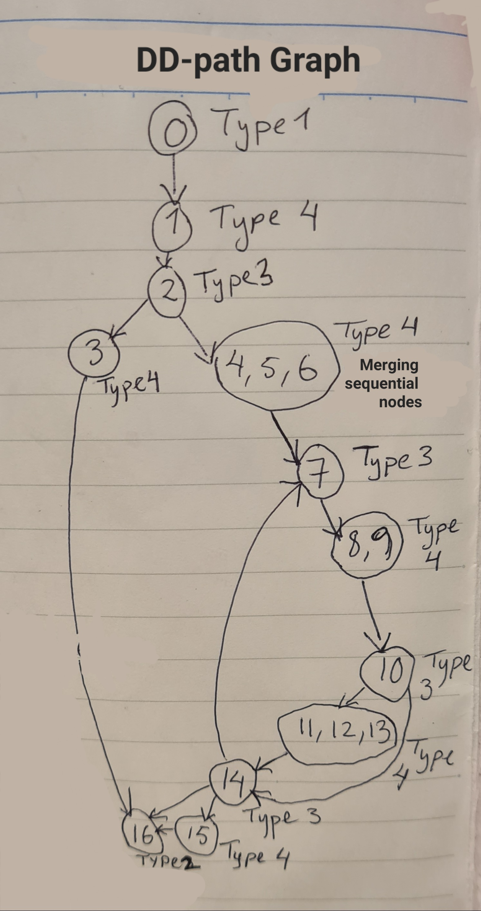
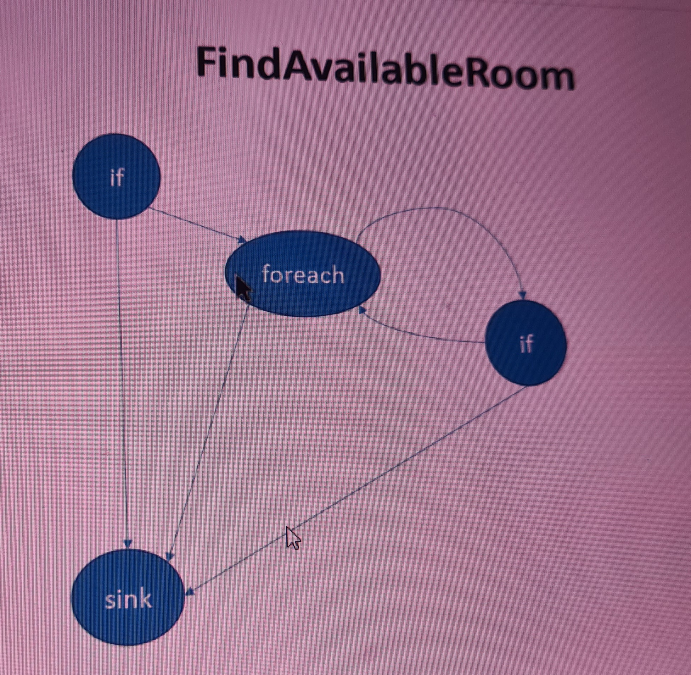

# HotelBooking_Clean_Async
 This assignment is the async version of HotelBooking_Clean solution

 ### Diagram for inspiration provided by the teacher:
 


 ### Feedback for Mini project part 1: 
 Data-driven unit tests (InlineData, MemberData, ClassData, DataAttribute) are important and should have been implemented. 


 ### Compulsary Assignment 3
 #### Program Graph: 
````
0       public async Task<int> FindAvailableRoom(DateTime startDate, DateTime endDate)
1       {
2           if (startDate <= DateTime.Today || startDate > endDate)
3               throw new ArgumentException("The start date cannot be in the past or later than the end date.");

4           var bookings = await bookingRepository.GetAllAsync();
5           var activeBookings = bookings.Where(b => b.IsActive);
6           var rooms = await roomRepository.GetAllAsync();
7           foreach (var room in rooms)
8           {
9               var activeBookingsForCurrentRoom = activeBookings.Where(b => b.RoomId == room.Id);
10              if (activeBookingsForCurrentRoom.All(b => startDate < b.StartDate &&
                    endDate < b.StartDate || startDate > b.EndDate && endDate > b.EndDate))
11              {
12                  return room.Id;
13              }
14          }
15          return -1;
16      }
````


**Feedback from presentation:** When there is a return, the path jumps straight to the sink node. So line 12 should have been straight to line 16 not through line 13 and 14.

##### DD-path Graph


**Feedback from presentation:** The DD graph could have been made even simpler, but it may harm readability:



### Cyclomatic Complexity
#### Simple way: Count the decision points
Initial count: 1

``if`` on line 2: + 1

``foreach`` on line 7: + 1

``if`` on line 10: + 1

Cyclomatic complexity = 4

#### McCabe's cyclomatic complexity formula C = E - N + 2P, where E is the number of edges, N is the number of nodes, and P is the number of connected components in the control flow graph
##### Nodes (representing points in the execution):
1.	Start of the method
2.	if condition (line 2)
3.	throw (line 3)
4.	Assignment of bookings (line 4)
5.	Filtering activeBookings (line 5)
6.	Assignment of rooms (line 6)
7.	Start of the foreach loop (line 7)
8.	if condition (line 10)
9.	return room.Id (line 12)
10.	End of the if (line 13)
11.	End of the foreach loop (line 14)
12.	return -1 (line 15)
13.	End of the method

N = 13 nodes

##### Edges (representing the flow of control between nodes):
1.	Start -> if condition
2.	if condition -> throw (when true)
3.	if condition -> Assignment of bookings (when false)
4.	Assignment of bookings -> Filtering activeBookings
5.	Filtering activeBookings -> Assignment of rooms
6.	Assignment of rooms -> Start of foreach
7.	Start of foreach -> if condition (first iteration)
8.	if condition -> return room.Id (when true)
9.	if condition -> End of if (when false)
10.	End of if -> End of foreach (inner loop completes or continues)
11.	End of foreach -> Start of foreach (next iteration, if any)
12.	End of foreach -> return -1 (after the loop finishes)
13.	return room.Id -> End of function
14.	return -1 -> End of function
15.	throw -> End of function

E = 15 edges

##### Connected Components (P):
The control flow graph is a single connected component - there are not separate subgraphs. 

P = 1 connected component

````
C = E − N + 2P
C = 15 − 13 + 2×1
C = 2 + 2 
C = 4
````

**Notes for exam project**: 
1. Pick code with interesting business logic
2. Derive test cases for unit tests using Path Testing (program graph, dd graph, cyclomatic complexity)
3. Create unit tests with Data-driven unit testing