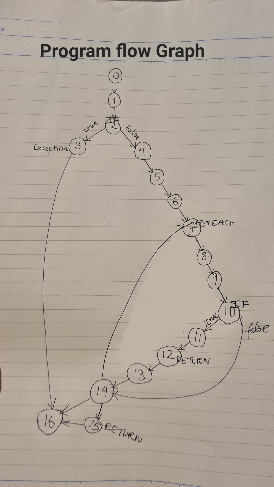

# HotelBooking_Clean_Async
 This assignment is the async version of HotelBooking_Clean solution

 ### Diagram for inspiration provided by the teacher:
 

 ### Feedback for Mini project part 1: 
 Data-driven unit tests (InlineData, MemberData, ClassData, DataAttribute) are important and should have been implemented. 

 ### Compulsary Assignment 3
 #### Program Graph: 
0       public async Task<int> FindAvailableRoom(DateTime startDate, DateTime endDate)
1       {
2           if (startDate <= DateTime.Today || startDate > endDate)
3               throw new ArgumentException("The start date cannot be in the past or later than the end date.");

4           var bookings = await bookingRepository.GetAllAsync();
5           var activeBookings = bookings.Where(b => b.IsActive);
6           var rooms = await roomRepository.GetAllAsync();
7           foreach (var room in rooms)
8           {
9               var activeBookingsForCurrentRoom = activeBookings.Where(b => b.RoomId == room.Id);
10              if (activeBookingsForCurrentRoom.All(b => startDate < b.StartDate &&
                    endDate < b.StartDate || startDate > b.EndDate && endDate > b.EndDate))
11              {
12                  return room.Id;
13              }
14          }
15          return -1;
16      }

